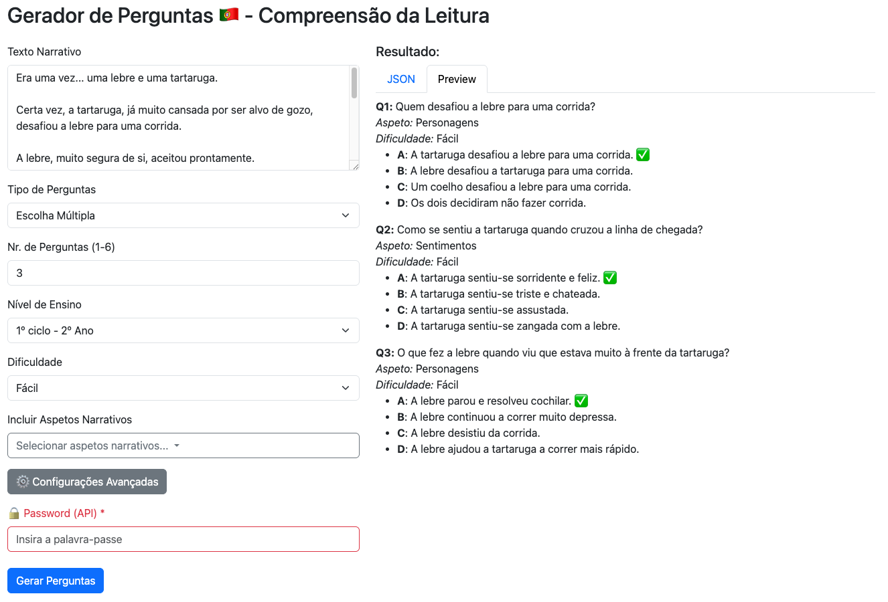

# gui-qg-llm

**Simple Interface for Portuguese Question Generation using LLMs**

This project is a frontend graphical user interface (GUI) designed to facilitate generating Portuguese reading comprehension questions. It operates as a lightweight client for a custom backend API that leverages large language models (LLMs) to generate questions based on provided narrative text and selected parameters.

## 🌐 Online GUI (GitHub Pages)

The interface is available at:  
👉 [https://benjleite.com/gui-qg-llm-pt/form.html](https://benjleite.com/gui-qg-llm-pt/form.html)



## ⚠️ Disclaimer:

This is only a GUI. It does not perform any question generation by itself - it communicates with a custom backend API of your choice.  
>  
> The API endpoint can be changed directly in the source code (inside the HTML file) at this section:
> ```javascript
>   // local example
>   const response = await fetch('http://127.0.0.1:5000/generate-questions', {
>   // deploy example
>   // const response = await fetch('https://api-qg-llm-pt.onrender.com/generate-questions', {
>   method: 'POST',
>   headers: {'Content-Type': 'application/json'},
>   body: JSON.stringify(payload)
>   });
> ```

## Features

- Input narrative text in Portuguese to generate relevant questions.
- Choose question type: Multiple-choice or Open-ended.
- Select the number of questions to generate (1 to 6).
- Specify educational level (grades 1 to 4 of the Portuguese primary cycle).
- Select difficulty level: random, easy, medium, or hard.
- Optionally include specific narrative aspects (characters, feelings, space, time, action, causality).
- Access advanced settings for fine-tuning the LLM generation parameters:
  - Model selection (currently GPT-4o).
  - Temperature, Max Tokens, and Top-p for controlling output randomness and length.
- Password protected API access.
- Outputs generated questions in both JSON format and a human-friendly preview.

## Usage

1. Enter the narrative text in the **"Texto Narrativo"** field.
2. Choose the type of questions to generate:
   - *Escolha Múltipla* (Multiple Choice)
   - *Resposta Aberta* (Open-ended)
3. Select the number of questions to generate (between 1 and 6).
4. Choose the **Nível de Ensino** (educational level), such as 1st-grade through 4th-grade.
5. Select the **Dificuldade** (difficulty): random, easy, medium, or hard.
6. Optionally, choose one or more narrative aspects to focus on, such as:
   - Personagens (Characters)
   - Sentimentos (Feelings)
   - Espaço (Space/Location)
   - Tempo (Time)
   - Ação (Action)
   - Causalidade (Causality)
7. (Optional) Expand **Configurações Avançadas** (Advanced Settings) to adjust:
   - LLM model
   - Temperature (controls randomness)
   - Max Tokens (max output length)
   - Top-p (nucleus sampling)
8. Enter your API password for authentication.
9. Click **Gerar Perguntas** to send the request to the backend API.
10. View results either as raw JSON or a formatted preview.

## API Parameters

The frontend sends the following parameters to the backend API `/generate-questions` endpoint as a JSON payload:

| Parameter           | Type          | Description                                                                 |
|---------------------|---------------|-----------------------------------------------------------------------------|
| `narrative_text`    | string        | The input narrative text in Portuguese to base questions on.               |
| `question_type`     | string        | Type of question: `"multiple-choice"` or `"open-ended"`.                   |
| `num_questions`     | integer       | Number of questions to generate (1 to 6).                                  |
| `education_level`   | string        | Educational level: `"1st-grade"`, `"2nd-grade"`, `"3rd-grade"`, `"4th-grade"`. |
| `difficulty`        | string        | Difficulty level: `"random"`, `"easy"`, `"medium"`, `"hard"`.              |
| `narrative_aspects` | array[string] | Selected narrative aspects (e.g., `"character"`, `"feeling"`, `"space"`, `"time"`, `"action"` or `"causal"`).       |
| `model_name`        | string        | LLM model to use (e.g., `"GPT-4o"`).                                       |
| `temperature`       | float         | Controls randomness of output (range: 0-2).                                |
| `max_tokens`        | integer       | Maximum tokens allowed in the generated output.                            |
| `top_p`             | float         | Nucleus sampling parameter (range: 0-1).                                   |
| `password`          | string        | API password for authentication.                                           |

## Example Input/Output

When sending a request with the following payload:

```json
{
  "narrative_text": "Era uma vez uma tartaruga e a lebre...",
  "question_type": "multiple-choice",
  "num_questions": 3,
  "education_level": "2nd-grade",
  "difficulty": "easy",
  "narrative_aspects": ["character", "feeling"],
  "model_name": "GPT-4o",
  "temperature": 1.0,
  "max_tokens": 2048,
  "top_p": 1.0,
  "password": "your_api_password_here"
}
```

You will receive a response similar to the following (this output structure is what the GUI expects from the backend API):

```json
{
  "questions": [
    {
      "aspeto": "Personagens",
      "dificuldade": "Fácil",
      "idade": "7-8",
      "nivel": "1º ciclo - 2º Ano",
      "opcoes": [
        {
          "correta": "Verdade.",
          "opcao": "A",
          "texto": "A tartaruga desafiou a lebre para uma corrida."
        },
        {
          "correta": "Falso.",
          "opcao": "B",
          "texto": "A lebre desafiou a tartaruga para uma corrida."
        },
        {
          "correta": "Falso.",
          "opcao": "C",
          "texto": "Os amigos da lebre desafiaram-na para uma corrida."
        },
        {
          "correta": "Falso.",
          "opcao": "D",
          "texto": "A tartaruga nunca desafiou a lebre para uma corrida."
        }
      ],
      "pergunta": "Quem desafiou a lebre para uma corrida?",
      "tipo": "escolha múltipla"
    },
    {
      "aspeto": "Sentimentos",
      "dificuldade": "Fácil",
      "idade": "7-8",
      "nivel": "1º ciclo - 2º Ano",
      "opcoes": [
        {
          "correta": "Verdade.",
          "opcao": "A",
          "texto": "A tartaruga sentia-se..."
        },
        {
          "correta": "Falso.",
          "opcao": "B",
          "texto": "A tartaruga sentia-se...."
        },
        {
          "correta": "Falso.",
          "opcao": "C",
          "texto": "A tartaruga sentia-se..."
        },
        {
          "correta": "Falso.",
          "opcao": "D",
          "texto": "A tartaruga sentia-se..."
        }
      ],
      "pergunta": "Como se sentia a tartaruga...?",
      "tipo": "escolha múltipla"
    },
    {
      "aspeto": "Sentimentos",
      "dificuldade": "Fácil",
      "idade": "7-8",
      "nivel": "1º ciclo - 2º Ano",
      "opcoes": [
        {
          "correta": "Verdade.",
          "opcao": "A",
          "texto": "A lebre perdeu a corrida porque parou para cochilar."
        },
        {
          "correta": "Falso.",
          "opcao": "B",
          "texto": "A lebre perdeu a corrida porque não quis correr."
        },
        {
          "correta": "Falso.",
          "opcao": "C",
          "texto": "A lebre perdeu a corrida porque começou atrasada."
        },
        {
          "correta": "Falso.",
          "opcao": "D",
          "texto": "A lebre perdeu a corrida porque teve um problema na perna."
        }
      ],
      "pergunta": "Por que motivo a lebre perdeu a corrida?",
      "tipo": "escolha múltipla"
    }
  ]
}
```

## Development Notes

- The frontend is a single HTML file using Bootstrap 5.
- Form submission handled via vanilla JavaScript (`fetch`).
- Two output views: raw JSON and formatted preview.
- To switch between local and deployed API, edit the fetch URL in the `<script>` section of the HTML.

## Future Improvements

- Add support for more LLM models and multilingual output (including json output attributes).
- Enhance UI with real-time validation and accessibility improvements.
- Optional export to PDF or DOCX.
- Store configuration presets for frequent users.

## Contact

Bernardo Leite (benjleite.com)

